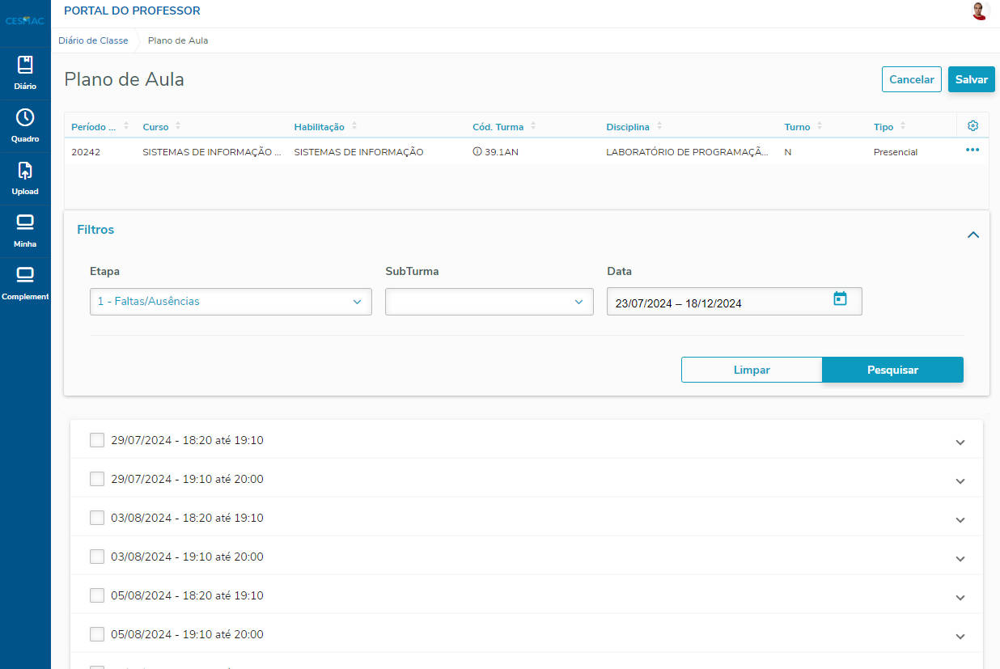

# SCRIPT PARA INSERIR PLANOS DE AULA 

## Passos
1 - Baixe o script e instala as dependências

```
git clone git https://github.com/CarlosWGama/script-selenium-plano-aula.git .
npm install
```

2 - Adicione o Chrome nas variaveis de ambiente do seu SO.

3 - Rode o Chrome numa porta especifica, como a 9111

```shell
chrome.exe --remote-debugging-port=9111 --user-data-dir="C:/teste-profile-remover-depois"
```

4 - No novo browser que abriu, acesse a página dos planos de aula e já busque todos os planos de aula.



5 - Altere o script.js adicionando no vetor seus planos de aula

```js
const planos = [
    'A', // 1
    'B', // 2
    'C', // 3
    'D', // 4
    'E' // 5
]   
```
- Ou, crie um modelo separado e apenas o importe

```js
import { LP1, BD, MOBILE, PP } from 'modelos'

const planos = LP1;
```


6 - (Passo opcional). Caso a porta do browser não seja a 9111, troque no arquivo do script.js

```js
options.debuggerAddress("127.0.0.1:9111")
```

7 - Execute o Script com o comando abaixo:

```shell
npm start
```